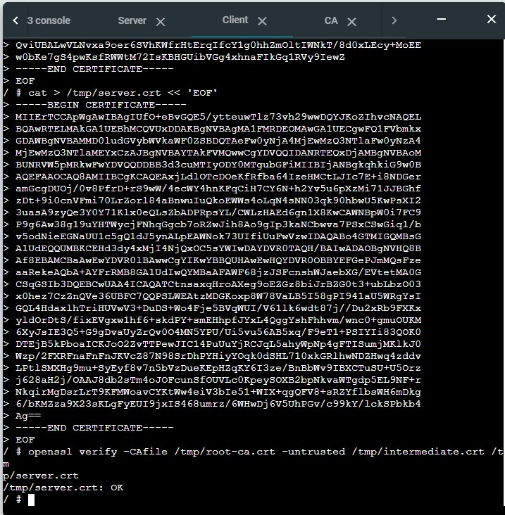
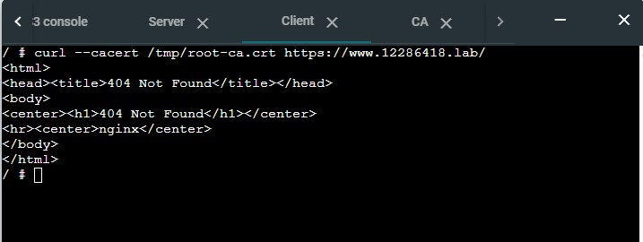
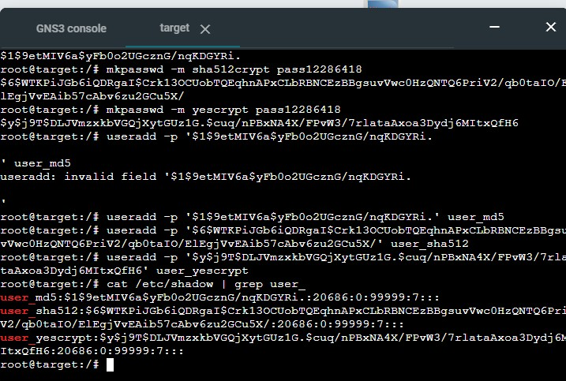
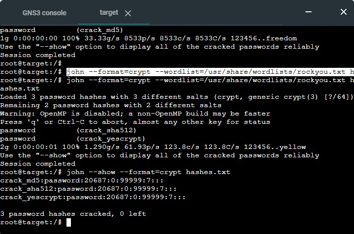
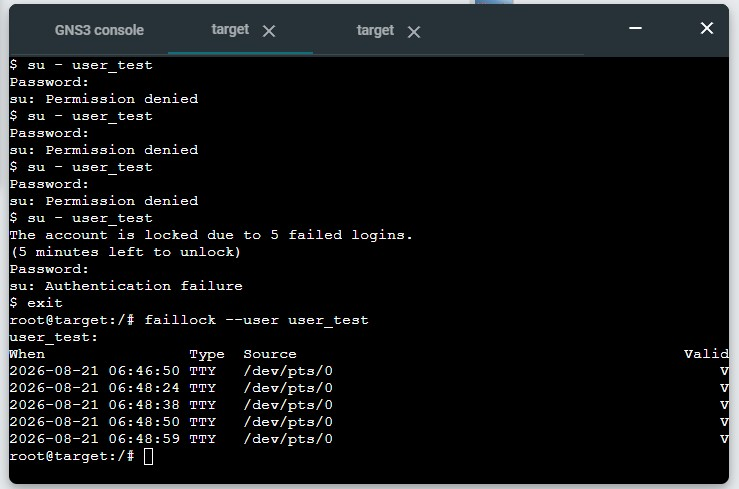
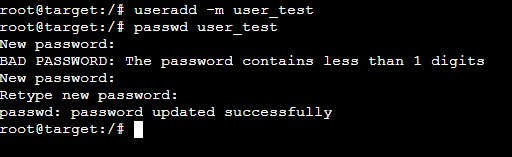
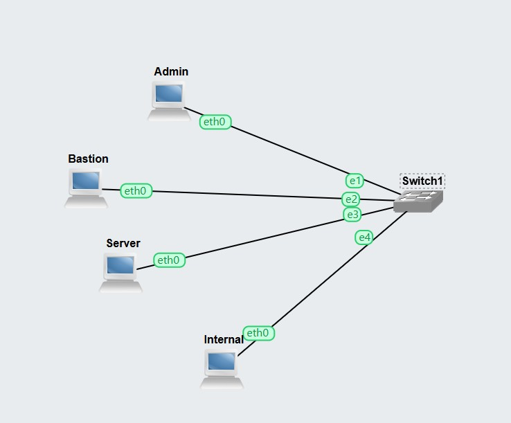
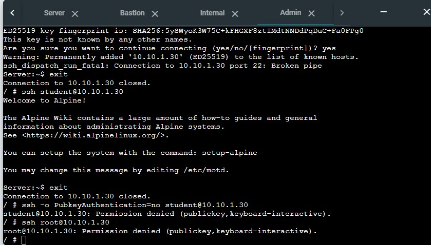
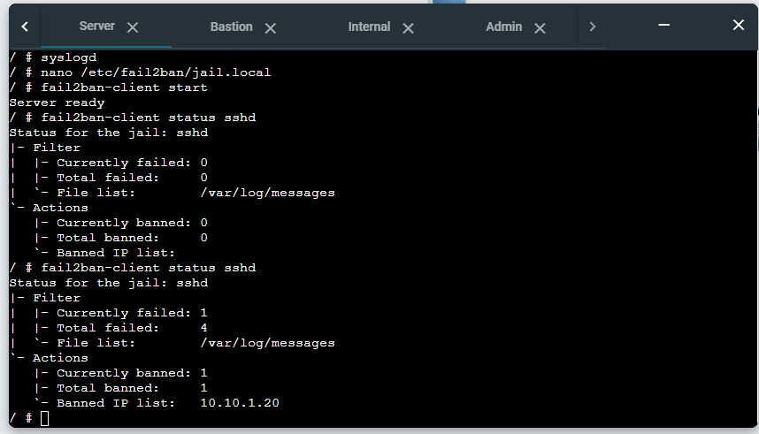
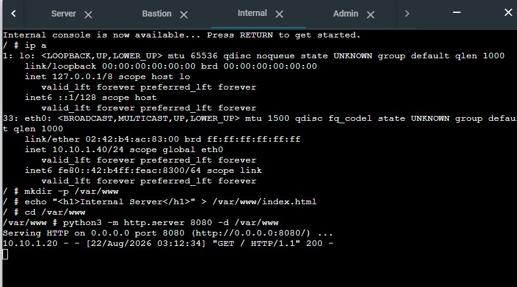

# COIT12202 - Assessment 1 Hardened Services Portfolio

Individual portfolio for Assessment 1, building and hardening three
security services on GNS3: PKI/HTTPS, password security, and SSH.

### Week 2 - OpenSSL PKI 

A two-tier Certificate Authority is built with OpenSSL and it is used to issue a certificate for a website
(`www.12286418.lab`). This is made over HTTPS through Nginx and the full trust
chain is presented and verified on a separate client.

It contains:
- `root-ca.crt`, `intermediate.crt`, `server.crt`, `ca-chain.crt` - These are the certificates 
- `commands.md` — these commands are used to build the CA hierarchy, sign
  the server certificate, build the chain file and verify it
- The screenshots showing `openssl verify` confirming the chain is OK and a successful `curl` HTTPS request

The screenshots are shown below

**Chain verification:**

**Successful HTTPS request:**

### Week 3-Password Hashing and Storage

We created three users on the Target host with different password hashing algorithms and used the same password. Then we configured PAM to make a password quality requirements which is 12 characters, one uppercase letter and at least one digit. We also made account lock policy if there are 5 failed attempts for 300 seconds. these two policies were both tested. A second set of users with weak password was cracked with John the ripper to compare cracking speed in three algorithms.

It contains:
- `hashes.txt` - These are three real algorithm hashes
- `crack-hashes.txt`- These are three intentional weak hashes which were used to show the cracking.
- `commands.md`- These commands are used to create the hash algorithm users, configure PAM password policy and account lockout policy and to show the cracking
- The screenshots showing the `/etc/shadow` with three hash prefixes and the John the ripper crack output

The screenshots are shown below

**Hash algorithms in /etc/shadow:**

**Cracking demonstration:**

**Account lockout after 5 failed attempts:**

**Password quality policy (weak rejected, strong accepted):**

### Week 4 - SSH Hardening

We built four hosts (Admin, Bastion, Server, Internal) on one switched LAN. we set up Ed25519 key-based authentication for both root and the pre-installed student account on Server. Then to authorize only by student, we hardened the SSh server to key only, verified by confirming key login succeeds while password and root login are both refused. Then we configured fail2ban to ban an address after 3 failed login attempts within 600 seconds. It is showed by triggering and confirming a
ban from the Bastion host. Finally, we used an SSH local port forward through Bastion to reach an internal web service on Internal.It proves that the tunnel carries the traffic on Admin, not the Internal host directly.

It contains:
- `sshd_config` — the hardened SSH server configuration
- `id_ed25519.pub` — the Admin host's public key
- `commands.md` — these commands are used to address the topology, set up key authentication, harden sshd, configure fail2ban and open the SSH tunnel
- The screenshots shows the hardened sshd_config enforcing keyonly login by student, the fail2ban ban in effect and the internal server log confirming the tunnel

The screenshots are shown below

**Network topology:**

**Hardened sshd_config enforcing key-only login by student:**

**fail2ban banning the Bastion address after repeated failures:**

**Internal server log showing the tunnel in effect:**

